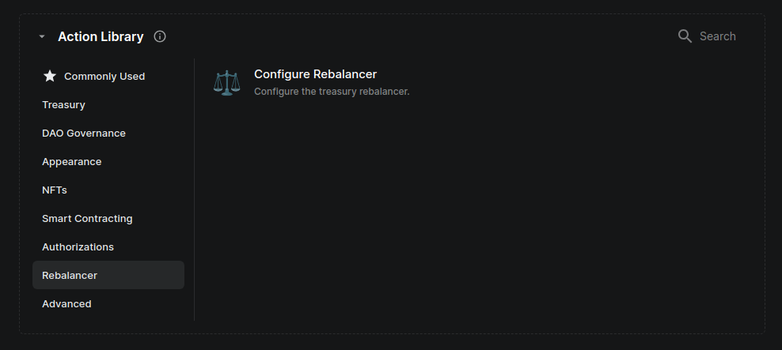

# Rebalancer User Guide

## Introduction

The rebalancer is a Valence service designed for Valence account holders, including users and DAOs, to adjust their portfolio or treasury to a desired target. During each rebalance cycle, users determine which assets need to be bought or sold to reach their target. Assets marked for sale are then auctioned off, allowing anyone to place bids on them.

## How to use it

### DAODAO

DAODAO offers a user interface that allows users to create an account, register it with the rebalancer using their preferred parameters, view the account's status, and manage it effectively. Here are the steps:

1. Create an account and register to the rebalancer.

   The first thing we have to do is create an account and register to the rebalancer, this is easily done by creating a Rebalancer proposal.

   

   By clicking on `Configure Rebalancer`, a modal will open with two options: `Create Rebalancer Account` and `Configure Rebalancer`. The `Create Rebalancer Account` option allows you to set up an account and fund it with the specified initial balances, along with the registration fee for the rebalancer (currently 1 NTRN). Example:

   

   In the example above, we are creating an account and funding it with 11 NTRN: 10 NTRN will be used as the account balance and 1 NTRN as the registration fee.

   NOTE: Not all tokens are supported by the rebalancer. The rebalancer has a set of whitelisted denoms and optional minimum balances for each denom that the account must hold to be considered for as `Base token`. Therefore, when creating an account via DAODAO, the token used as `Base token` must be funded with at least its minimum balance. For example, at the time of this proposal, the minimum balance for NTRN and ATOM is 10. If you attempt to create a rebalancer account and fund it with 9 NTRN instead of 10 with NTRN as `Base token`, the proposal will not be created, and an error message regarding minimum balances will appear. On the other hand, if you attempt to create a rebalancer account and fund it with 10 NTRN and 2 ATOM with NTRN as `Base token`, the proposal will be created successfully, even though the minimum balance for ATOM is not met.

   The second option allows you to configure the rebalancer for your account. This involves several actions that are self-explanatory in the user interface. One important detail to note is that the `Base token` must be one of the tokens provided in the `Initial balances` and must be present in the `Token targets`. Here's an example:

   

   In the configuration above, and considering that our initial balance was 10 NTRN, we are setting the `Token targets` to 10% for NTRN and 90% for USDC in dollar value. This means that the rebalancer will slowly sell NTRN and buy USDC until we have 1$ in NTRN for every 9$ in USDC. We could speed up this process in the `Speed` section. At least one of the tokens in `Token targets` must be one funded in `Initial balances`.
   In the advanced section we also have the option to provide a maximum % of our portfolio value that can be auctioned off in every cycle and the option to decide how to deal with conflicts between the `Minimum balance` (if specified) and the `Token targets`.

   Once the proposal is executed, it will create an account and register it with the parameters we provided and the rebalancer will start managing our portfolio.

2. View the account and rebalancer status.

   After registering with the rebalancer, the `Rebalancer` section will appear under `Treasury` in our DAO's treasury section. Initially, and before the first cycle, this section will have no data. However, once the first rebalance occurs, it will display a graph along with the token amounts and values of our account. Here's an example:

   

   For this account, the rebalancer is currently managing four tokens: NEWT, USDC, ATOM, and NTRN. The graph displays the dollar value of these tokens at any given time, the percentage of the portfolio they represent, and the target set for each token in the rebalancer.

3. Manage the account.

   If we need to perform admin actions on the rebalancer, we can do so by creating a proposal, similar to how we initially created the account. Since the rebalancer account is already set up, we will now see additional possible actions:

   

   As shown in the image above, you can reconfigure the rebalancer with new parameters, which will open the `Configure Rebalancer` modal used in Step 1. Additionally, you can fund the account with tokens from the DAO treasury, withdraw tokens to the treasury, and choose to pause or resume the rebalancer.
